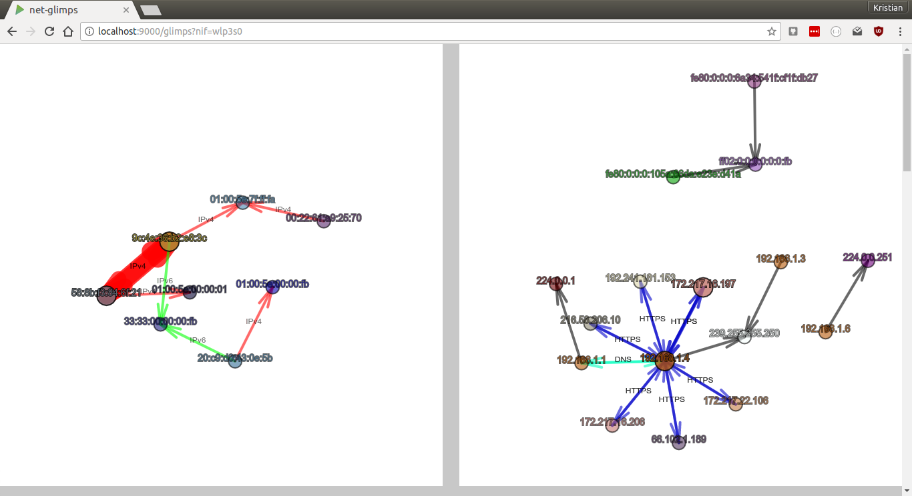

# net-glimps

I wanted to have a little tool that can give me a quick overview on what's going in my network. Tools like Wireshark are great but don't give you this 'glimps'. 

net-glimps consists of two parts: 1) Visualization of network traffic, and 2) Streaming of header data from your network interfaces via WebSockets.



### Used technologies

* Java, JavaScript
* Pcap4J (https://github.com/kaitoy/pcap4j) to access network interfaces
* Play Framework 2.5
* Akka to distribute network interface data to multiple WebSockets
* Graphics with [p5js](https://p5js.org/) and physics with [toxiclibs](https://github.com/hapticdata/toxiclibsjs)

## How to run

1. [Download](https://github.com/kristian-lange/net-glimps/releases)

1. Unzip

1. To access network interfaces you have to start the program either with **root** or give java special capabilities, e.g. with `sudo setcap cap_net_raw,cap_net_admin=eip /usr/lib/jvm/java-8-openjdk-amd64/jre/bin/java`.

1. Run on Linux or Unix/MacOS `./bin/net-glimps`
   
   You can specify IP and port with the parameters `-Dhttp.address` and `-Dhttp.port`. By default `localhost` and `9000` is used. E.g. `./bin/net-glimps -Dhttp.address=172.23.1.81 -Dhttp.port=8080` binds net-glimps to IP `172.23.1.81` and port `8080`.

1. Try in a browser, e.g. with `http://localhost:9000/?nif=wlp3s0` for network interface `wlp3s0` to get all raw header data


## Visualization of network traffic

1. `/glimps?nif=myNetworkInterface` - shows both, Ethernet and Internet
   
1. `/ipglimps?nif=myNetworkInterface` - shows only Internet
   
1. `/etherglimps?nif=myNetworkInterface` - shows only Ethernet

1. `/?nif=myNetworkInterface` - shows raw packet header data in JSON

E.g. [`http://localhost:9000/glimps?nif=wlp3s0`](http://localhost:9000/glimps?nif=wlp3s0) shows a visualization of the Ethernet layer and the Internet layer of the network interface `wlp3s0`.

You can open multiple pages of the same or different network interface(s) at the same time.

### Visualization Details 

* Nodes represent MAC or IP addresses
* Node colors are determined by the MAC or IP address
* Nodes blink when a new packet is sent
* Edges represent sent packets
* The arrow shows the direction of the sent packet
* The edges get thicker the more packets are send
* Edge colors are determined by the EtherType (Ethernet) or TCP/UDP port (Internet) (scroll down to see a glossary)
* If EtherType or port is one of the well known ones it's annotated at the edge (scroll down to see a glossary)
* Edges of unknown EtherTypes or ports are black/gray and by default aren't shown at the edge (can be changed in the config)
* Nodes and edges get removed after a while if no packets are sent (default is 10 s)
* In fullscreen mode the whole screen is used for the graph(s)

### Configuration

Many parameters (e.g. colors, node size, node repulsion, cleaning interval) can be changed in `./config/glimps.conf`. Have a look they have comments.


## Streaming of header data from your network interfaces via WebSockets

If you just want to get the header data without the visualization you have to open a WebSocket with the URL `/netdata` and the network interface you want to intercept has to be specified in the query string with the parameter 'nif'. 

E.g. in JavaScript (browser) to get traffic from the network interface `wlp3s0` one could write

```javascript
var socket = new WebSocket(ws://myhost/netdata/?nif=wlp3s0);
```

or more general with secure WebSockets and assuming net-glimps runs on the same host as your JavaScript is served.

```javascript
var socket = new WebSocket(
      ((window.location.protocol === "https:") ? "wss://" : "ws://") +
      window.location.host + "/netdata/?nif=wlp3s0");
```

The data format is JSON. The endpoint `/?nif=myNetworkInterface` just shows the raw data.

* It is possible to **stream different network interfaces in parallel**.
* It is also possible to **stream the same network interface to multiple destinations**.
