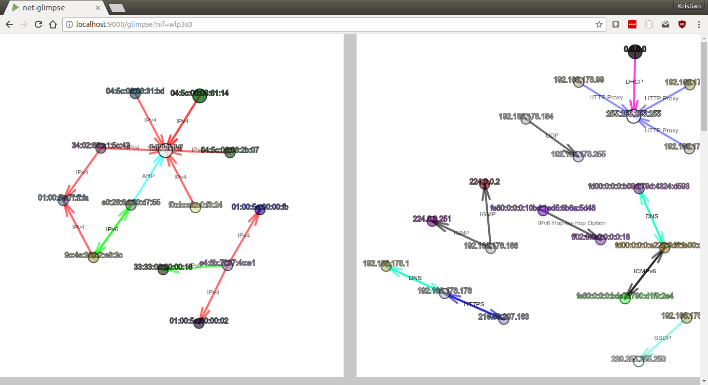
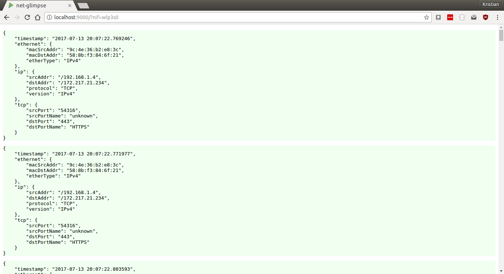
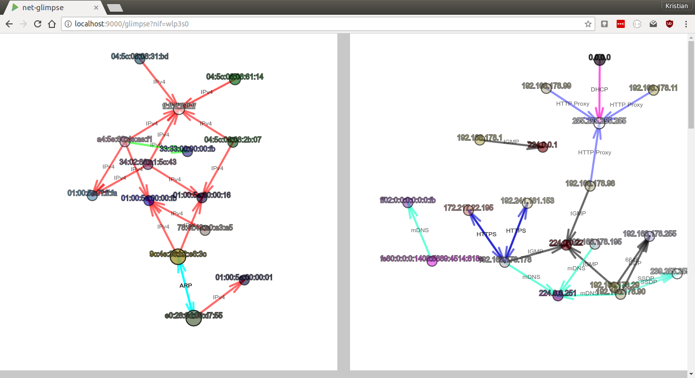
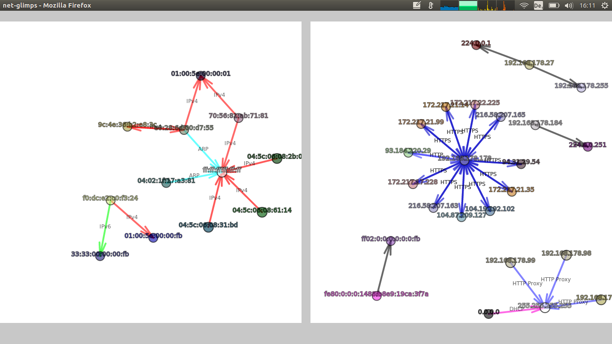

# net-glimpse

I wanted to have a little tool that can gives me a quick overview on what's going in my network, displaying it in the browser. Tools like tcpdump or [Wireshark](https://www.wireshark.org/) are great but don't give you this 'glimpse'.

net-glimpse has two parts: 1) Visualization of network traffic (Ethernet and/or Internet), and 2) Streaming of header data from your network interfaces via WebSockets.

**Have a look at [this video](https://youtu.be/Nvm5NaTZLGY).**



### Used technologies

* Java, JavaScript
* Pcap4J (https://github.com/kaitoy/pcap4j) to access network interfaces
* Play Framework 2.5 and sbt
* [Akka](http://akka.io/) to distribute network interface data to multiple WebSockets
* Graphics with [p5js](https://p5js.org/) and physics with [toxiclibs](https://github.com/hapticdata/toxiclibsjs)

## How to run

net-glimpse works on **Linux/Unix** (including **Mac OS X**) and **Windows**.

**Prerequisites:**
* net-glimpse needs **Java 8** to run.
* For the visualizations you need a modern browser (one that supports WebSockets and WebGL).
* On **Windows** it is necessary to install Npcap (https://nmap.org/npcap/) **OR** winpcap (https://www.winpcap.org/). On **Linux/Unix** libpcap is needed.

1. [Download the net-glimpse-x.x.zip](https://github.com/kristian-lange/net-glimpse/releases)

1. Unzip and change into the unzipped folder

1. On **Linux or Unix** to access network interfaces you have to start the net-glimpse either as **root** or give Java special capabilities, e.g. with `sudo setcap cap_net_raw,cap_net_admin=eip /usr/lib/jvm/java-8-openjdk-amd64/jre/bin/java` (but exchange the path to your Java installation). On **Windows** you will be ask after starting net-glimpse's batch file if you want to grant access to the network interfaces.

1. On **Unix** it might be necessary to make the run script executable: `chmod u+x ./bin/net-glimpse`

1. Run on **Linux or Unix** in the terminal `./bin/net-glimpse` - on **Windows** double-click the `./bin/net-glimpse.bat`
   
   You can specify IP and port with the parameters `-Dhttp.address` and `-Dhttp.port`. By default `localhost` and `9000` is used. E.g. `./bin/net-glimpse -Dhttp.address=172.23.1.81 -Dhttp.port=8080` binds net-glimpse to IP `172.23.1.81` and port `8080`.
   
   If net-glimps does not want to start have a look in its installation folder whether you find a file RUNNING_PID. Delete it and start again.

1. Try in a browser, e.g. with `http://localhost:9000/?nif=myNetworkInterface` (instead of `myNetworkInterface` use the name of the network interface you want to intercept)
   
   net-glimps prints out potential network interface names (NIF) in it's log. You can copy-paste one from there. This is especially handy on **Windows** where they have names like, e.g. `\Device\NPF_{998BB72F-3468-413E-813C-7E3A2E7B591B}` which would lead to the URL `http://localhost:9000/?nif=\Device\NPF_{998BB72F-3468-413E-813C-7E3A2E7B591B}`.
   
   The resulting webpage shows a list of raw packet header data in JSON format.
   
   

1. If you are done with net-glimpse you can stop it with `Ctrl+C`.

## Visualization of network traffic

Endpoints are:

1. `http://localhost:9000/glimpse?nif=myNetworkInterface` - shows both, Ethernet and Internet
   
1. `http://localhost:9000/ipglimpse?nif=myNetworkInterface` - shows only Internet
   
1. `http://localhost:9000/etherglimpse?nif=myNetworkInterface` - shows only Ethernet

1. `http://localhost:9000/?nif=myNetworkInterface` - shows raw packet header data in JSON

E.g. [`http://localhost:9000/glimpse?nif=wlp3s0`](http://localhost:9000/glimpse?nif=wlp3s0) shows a visualization of the Ethernet layer and the Internet layer of the network interface `wlp3s0`. 



**You can open multiple pages of the same or different network interface(s) at the same time.**

### Visualization Details 

* You can press 'p' to pause the drawing at any time
* It's actually a [force-directed graph](https://en.wikipedia.org/wiki/Force-directed_graph_drawing)
* Nodes represent MAC or IP addresses
* Node colors are determined by the MAC or IP address
* Nodes blink when a new packet is sent
* Edges represent sent packets
* The arrow shows the direction of the sent packet
* The edges get thicker the more packets are sent
* The EtherType (in the Ethernet visualization) is annotated at the edge (scroll down - under the graphic is a glossary)
* In the Internet visualization if it is a TCP or UDP packet and the port is one of the well known or registered ones (port 0 to 49151) the port is annotated at the edge. The most common port numbers are exchanged with their names, eg. port 22 is exchanged with SSH (scroll down - under the graphic is a glossary).
* If it's the Internet and not a TCP or UDP packet then the protocol name is annotated at the edge.
* Edges of unknown EtherTypes or Internet packets are black/gray by default (but you can add new types in the config)
* Nodes and edges get removed after a while if no packets are sent (default is 10 s)
* In fullscreen mode the whole screen is used for the graph(s) - otherwise they have a squared canvas

### Configuration

Many parameters of the visualizations (e.g. colors, node size, node repulsion, cleaning interval) can be changed in `./config/glimpse.conf`. Have a look - they have comments.




## Streaming of header data from your network interfaces via WebSockets

If you just want to get the header data without the visualization you have to open a WebSocket with the URL `/netdata` and the network interface you want to intercept has to be specified in the query string with the parameter 'nif'. 

E.g. in JavaScript (browser) to get traffic from the network interface `wlp3s0` one could write

```javascript
var socket = new WebSocket(ws://myhost/netdata/?nif=wlp3s0);
```

or more generally with secure WebSockets and assuming net-glimpse runs on the same host as your JavaScript is served.

```javascript
var socket = new WebSocket(
      ((window.location.protocol === "https:") ? "wss://" : "ws://") +
      window.location.host + "/netdata/?nif=wlp3s0");
```

The streamed packet header data are in JSON format.

* It is possible to **stream different network interfaces in parallel**.
* It is also possible to **stream the same network interface to multiple destinations**.

